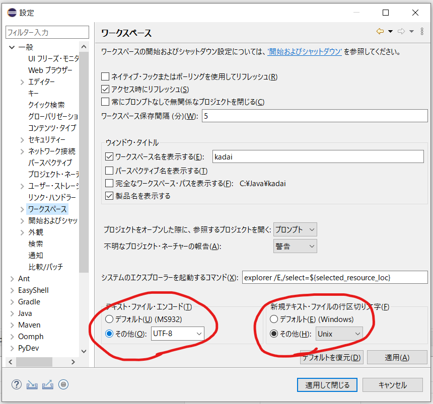
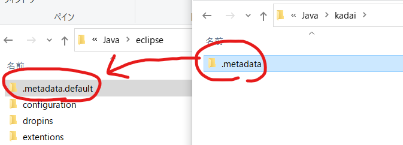

.. _japanese:

Eclipseの日本語化
===========================================

MergeDocを用いた日本語化およびワークスペース上の文字コードをUTF-8で対応するための処置である。

MergeDocの導入
------------------------

一度Eclipseを展開した後、 `Pleiadesプラグインをダウンロード <https://mergedoc.osdn.jp/pleiades-redirect/pleiades-win.zip.html>`_ して展開後、セットアップツールにて適用すれば良い。

セットアップ後Eclipseを起動すれば日本語化された状態で起動する。

ワークスペースのUTF-8デフォルト化
------------------------------------------

一度Eclipeを起動してワークスペースを用意する。ワークスペースの場所はどこにしても良いが、あとで設定から消すときに使うので、パスはメモしておくこと。
ワークスペースの設定を開き、 :menuselection:`ウィンドウ --> 設定` で設定ウィンドウを開く。
設定ウィンドウ上で :menuselection:`一般 --> ワークスペース` と選ぶと文字コードの設定が下部にあるため、 **UTF-8** を選択する。
また、改行コード設定をUNIXに設定しておくことで、OSをまたいだ開発もスムーズに行えるようになるため、併せて行っておく。

    ワークスペースデフォルトにて、文字コードが改行コードを変更

ワークスペースデフォルトの配置
----------------------------------------------

上記の設定をデフォルト化するために、ワークスペース上のメタデータをコピーして配置する。

#. 一度Eclipseを終了する
#. ワークスペースのフォルダを開く
#. :file:`.metadata` フォルダを確認し、 :file:`eclipse.exe` と同じフォルダに :file:`.metadata.default` という名前でコピーする

    設定のデフォルト化

なおこの作業は、設定ウィンドウにて何らかの設定を行った際に繰り返しておくこと。
コピー後、新しくワークスペースを作り、切り替えたときに反映されているかを確認すれば良い。

#. :menuselection:`ファイル --> ワークスペースの切り替え --> その他…`
#. 適当なフォルダーを指定してワークスペースを作成・切り替える
#. :menuselection:`ウィンドウ --> 設定` で設定ウィンドウを開き、ワークスペースの設定を確認して、UTF-8およびUNIXになっていればOK

このワークスペースも後ほど消すことになるのでメモしておくこと。

