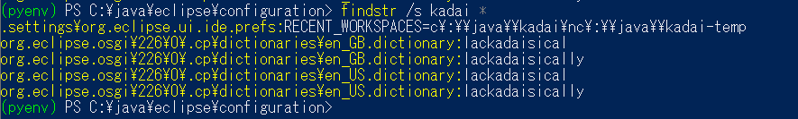

.. _packing:

アーカイブの作成
========================

配布用アーカイブを作成するために、少し準備をする。

ワークスペースの破棄
------------------------

Eclipseを終了後、作成したワークスペースを削除する。
使用していたワークスペースのパスは、Eclipseのプログラムフォルダにある :file:`configuration` フォルダ上でPowerShellを開き、文字列を検索する。
ここではパスの断片として `kadai` を検索する。

.. code-block:: ps1

    PS> findstr /s kadai

    ワークスペース設定の痕跡探索(その1)

ここでは :file:`.settings/org.eclipse.ui.ide.prefs` 中にあるということがわかるため、該当ファイルを開き、設定を破棄する。
:code:`RECENT_WORKSPACE` そのものは残しておく方が良いと思われるので、右辺を消す形にしておく。

.. code-block::
    :linenos:
    :emphasize-lines: 2

    MAX_RECENT_WORKSPACES=10
    RECENT_WORKSPACES=c\:\\java\\kadai\nc\:\\java\\kadai-temp
    RECENT_WORKSPACES_PROTOCOL=3
    SHOW_RECENT_WORKSPACES=false
    SHOW_WORKSPACE_SELECTION_DIALOG=true
    eclipse.preferences.version=1

.. code-block::
    :linenos:
    :emphasize-lines: 2

    MAX_RECENT_WORKSPACES=10
    RECENT_WORKSPACES=
    RECENT_WORKSPACES_PROTOCOL=3
    SHOW_RECENT_WORKSPACES=false
    SHOW_WORKSPACE_SELECTION_DIALOG=true
    eclipse.preferences.version=1

同様に、 :file:`.metadata.default` フォルダー内も検索し、該当するものがあれば適宜削除していけば良い(XMLの文法を破壊しないよう注意すること)。

ログの削除
-------------------

生成されているログファイルの類いを削除する。

.. code-block:: ps1

    PS> Get-ChildItem -Recurse *.log | Remove-Item -Verbose 

    ログファイルの削除

アーカイブの作成
---------------------------

あとは、eclipseのディレクトリをzipツールにてアーカイブすればよい。
なおOS標準のzipでも可能だが、より確実に行うのであれば、7zipを導入し、zipファイルの作成を7zipにて行う方がより安全とも言える。
圧縮レベルは『高速』レベルで十分であるが、最終配布物にする際は最高圧縮に設定し、時間をかけて行っても良い(ただし標準の圧縮フォルダーで処理できるかを再確認しておくこと)。
